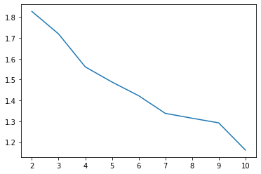
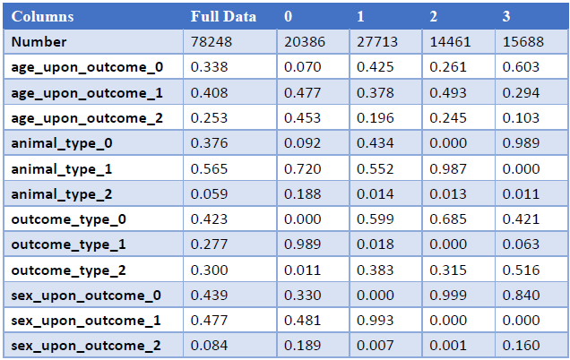
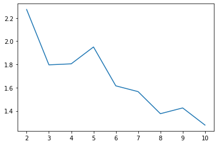
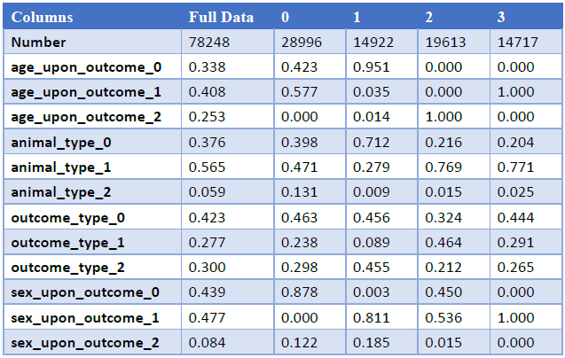
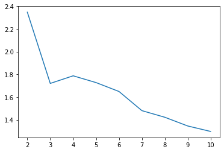
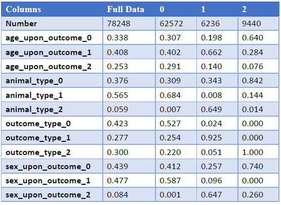

### Kaggle Competition：
https://www.kaggle.com/aaronschlegel/austin-animal-center-shelter-outcomes-and/data

### Kaggle Cluster - KMeans：

* 結果說明：
*  經過 Davies–Bouldin Index 評估後，可以從圖中看見分為5群較為適合。
*  Cluster-0：在此分群中可以看見，計畫類型較為平均、 貨幣為非美元的較多、 計畫狀態為失敗的比例較高、 國家皆為非美的。
*  Cluster-1：在此分群中可以看見，計畫類型為多媒體比例較高、貨幣主要都是使用美元、計畫狀態多數為成功案例支持者比也較高國家幾乎為美國、 群眾捐款的總額比例較高。
*  Cluster-2：在此分群中可以看見，計畫類型為多媒體比例較高、貨幣主要都是使用美元、計畫狀態多數為失敗案例支持者比也較低國家幾乎為美國、群眾捐款的總額比例較低。
*  Cluster-3：在此分群中可以 看見，計畫類型為多媒體比例較高、貨幣主要都是使用美元、計畫狀態多數為成功案例支持者比較中間國家幾乎為美國、群眾捐款的總額比例較中間計畫目標金則揭示最小金額、整個計畫持續時間較短。
*  Cluster-4：在此分群中可以看見，計畫類型為多媒體比例較高、貨幣主要都是使用美元、計畫狀態多數為失敗案例支持者比較中間國家

### Kaggle Cluster - GaussianMixture：

* 結果說明：
*  經過Davies–Bouldin Index評估後，可以從圖中看見越往後Index指數則越低，但在第4群時有一個小坡度，因此我採用4群作為分類較好解釋。
*  Cluster-0：在此分群中可以看見，年紀多數較為中低年齡的動物、動物種類則為貓狗居多、動物最後結果為收養比例略高、動物性別則幾乎為母性動物。
*  Cluster-1：在此分群中可以看見，年紀多數為較低年齡的動物、動物種類則為貓比例較高、動物最後結果則為收養或轉移居多、動物性別則幾乎為公性動物。
*  Cluster-2：在此分群中可以看見，年紀多數較為高年齡的動物、動物種類則為狗居多、動物最後結果則為Other的機率略高、動物性別則較為平均，在Other中則有包括安樂死、遺失等例外狀況。
*  Cluster-3：在此分群中可以看見，年紀多數為中間年齡的動物、動物種類則狗的比例較高、動物最後結果則為收養的比例略高，動物性別則幾乎為公性動物。

### Kaggle Cluster - Birch：

* 結果說明：
*  經過Davies–Bouldin Index評估後，可以從圖中看見越往後Index指數則越低，但在第3群時有一個小坡度，因此我採用3群作為分類較好解釋。
*  Cluster-0：在此分群中可以看見，年紀多數較為中低年齡的動物、動物種類則為貓狗居多、動物最後結果則被收養的機率略高些、動物性別則較為平均。
*  Cluster-1：在此分群中可以看見，年紀多數較為中間年齡的動物、動物種類則為其他居多、動物最後結果則為Other機率較高、動物性別則較為平均，但由於資料筆數較少因此結果也較不準確。
*  Cluster-2：在此分群中可以看見，年紀多數較為中低年齡的動物、動物種類則為貓居多、動物最後結果則皆是被轉移、動物性別則為母性動物比例較高，但由於資料筆數較少因此結果也較不準確。
