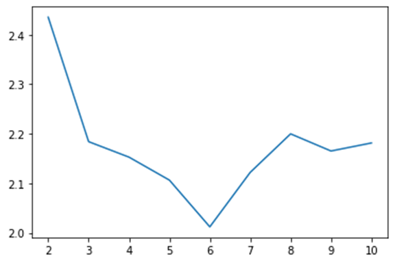
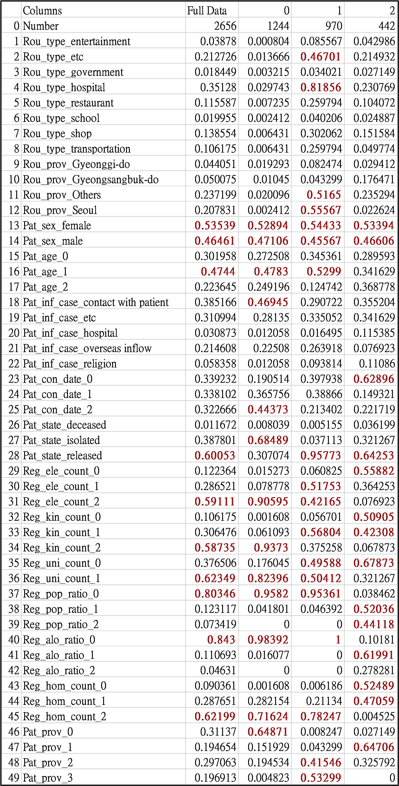
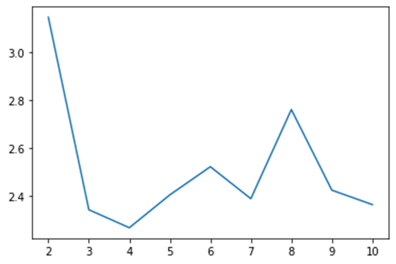
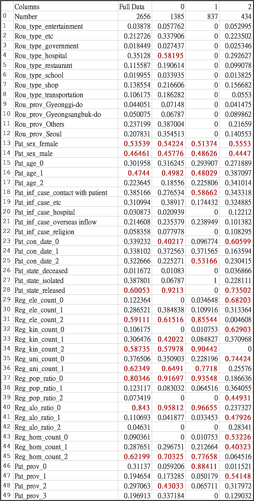
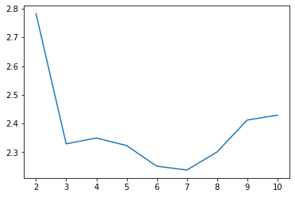
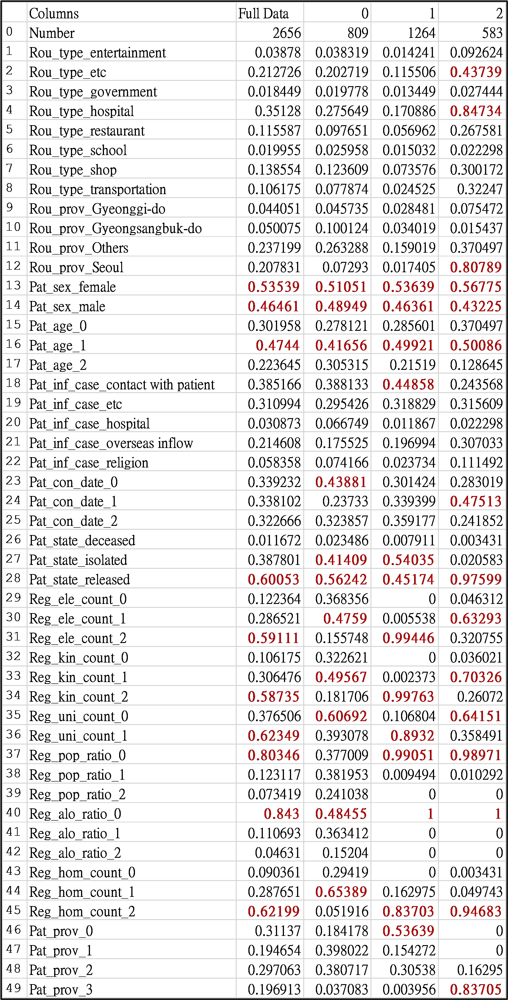

### Kaggle Competition：
https://www.kaggle.com/kimjihoo/coronavirusdataset

### Kaggle Cluster - KMeans：

* 結果說明：
*  經過 Davies–Bouldin Index 評估後，6群雖然較為適合，但為了方便探討以下皆使用3群。
*  分群結果 - Group 0：
1. 此群組的人性別較為平均，年齡則多數為中年人，被感染原因多數為與其他感染者有接觸，受感染的日期是在晚期，狀態目前多為觀察中，受感染地區為Gyeonggi-do(京畿道)居多。
2. 被感染者地區方面：
國小數量為多數，高中數量為多數，大學數量也為多數，老年人口比例較低，療養中心數量則較高。
3. 我們認為此群為 時常在外工作的中年人，
因為工作原因需時常接觸其他人，因此防疫也較難做好。
*  分群結果 - Group 1：
1. 此群組的人曾經去過Seoul(首爾)或Others地區的醫院居多，性別較為平均，年齡則多數為中年人，被感染原因則較為平均，狀態目前多為出院，受感染地區為Seoul (首爾)或Others地區居多。
2. 被感染者地區方面：
國小數量為多數，高中數量為多數，大學數量較為平均，老年人口比例較低，療養中心數量則較高。
3. 我們認為此群為 因為生活在Seoul (首爾)(韓國首都)，
因此在外出時會接觸到較多其他各方面的人，包括外國人等，但也因為Seoul (首爾)的醫療方面良好，因此出院比率也較高許多。
*  分群結果 - Group 2：
1. 此群組的人性別較為平均，年齡則多數為中年人，被感染原因則與病患接觸或其他感染因素居多，受感染的日期是在早期，狀態目前多為出院或觀察中，受感染地區為Gyeongsangbuk-do (慶尚北道)地區居多。
2. 被感染者地區方面：
國小數量較少，高中數量較少，大學數量數量較少，老年人口比例較高，療養中心數量則較低。
3. 我們認為此群為 因為生活在Gyeongsangbuk-do(慶尚北道)地區較廣，但同樣也較為偏鄉，因此老年人口居多，受感染比例也較高，雖然感染者死亡比例較低，但也較其他兩群來的高許多，同時也可以從中觀察到 也許是因為老年人感染存活率本身不高，也有可能是因為地區大醫療資源較不集中，因此死亡比率也來的高一點。

### Kaggle Cluster - GaussianMixture：

* 結果說明：
*  經過 Davies–Bouldin Index 評估後，6群雖然較為適合，但為了方便探討以下皆使用3群。
*  分群結果 - Group 0：
1. 此群組的人曾去過醫院居多，性別較為平均，年齡則多數為中年人，被感染原因則與病患接觸或其他感染因素居多，受感染的日期是在早期，狀態目前多為出院，受感染地區為Seoul(首爾)或Others地區。
2. 被感染者地區方面：
國小數量為多數，高中數量為多數，大學數量較為多數，老年人口比例較低，療養中心數量則較高。
3. 我們認為此群與Kmeans的Group 1相似，較為不同的是受感染的日期偏早期居多
*  分群結果 - Group 1：
1. 此群組的人性別較為平均，年齡則多數為中年人，被感染原因多數為與其他感染者有接觸，受感染的日期是在晚期，狀態目前多為觀察中，受感染地區為Gyeonggi-do(京畿道)居多。
2. 被感染者地區方面：
國小數量為多數，高中數量為多數，大學數量也為多數，老年人口比例較低，療養中心數量則較高。
3. 我們認為此群與Kmeans的Group 0相似。
*  分群結果 - Group 2：
1. 此群組的人性別較為平均，年齡較為平均，被感染原因則與病患接觸或其他感染因素居多，受感染的日期是在早期，狀態目前多為出院，受感染地區為Gyeongsangbuk-do (慶尚北道)地區居多。
2. 被感染者地區方面：
國小數量較少，高中數量較少，大學數量數量較少，老年人口比例較高，療養中心比例則較低。
3. 我們認為此群與Kmeans的Group 2相似，較為不同的是年齡在Kmeans的Group 2中偏向於年齡較高者，而在此群中則偏向於年齡平均。

### Kaggle Cluster - Birch：

* 結果說明：
*  經過 Davies–Bouldin Index 評估後，6群雖然較為適合，但為了方便探討以下皆使用3群。
*  分群結果 - Group 0：
1. 此群組的人性別較為平均，年齡多為中年人，被感染原因則與病患接觸或其他感染因素居多，受感染的日期是在早期，狀態目前多為出院或觀察中，受感染地區為Gyeongsangbuk-do (慶尚北道)或Others地區居多。
2. 被感染者地區方面：
國小數量較平均，高中數量平均，大學數量數量較少，老年人口比例較平均，療養中心比例則較平均。
3. 我們認為此群與Kmeans的Group 2相似，較為不同的是除了Gyeongsangbuk-do (慶尚北道)地區以外加入了Others，因此在教育或醫療資源方面也較為平均化，且此病患出院與觀察則較為平均。
*  分群結果 - Group 1：
1. 此群組的人性別較為平均，年齡則多數為中年人，被感染原因則與病患接觸或其他感染因素居多，狀態目前多為出院或觀察中，Gyeonggi-do(京畿道)居多
2. 被感染者地區方面：
國小數量為多數，高中數量為多數，大學數量較為平均，老年人口比例較低，療養中心比例則較高。
3. 我們認為此群與Kmeans的Group 0相似，較為不同的是在日期方面Kmeans分群為晚期的人，而在這邊則較為平均。
*  分群結果 - Group 2：
1. 此群組的人曾經去過Seoul(首爾) 地區的醫院居多，性別較為平均，年齡則多數為中年人，被感染原因則較為平均，受感染的日期是在中期，狀態目前多為出院，受感染地區為Seoul (首爾) 地區居多。
2. 被感染者地區方面：
國小數量為多數，高中數量為多數，大學數量較為平均，老年人口比例較低，療養中心數量則較高。
3. 我們認為此群與Kmeans的Group 1相似，較為不同的是此群幾乎為Seoul地區的分析，並沒有像Kmeans的Group 1 一樣有加入Others地區進入，此外在受感染的日間上，Kmeans的Group是較為平均的，而在這邊則是以中期為居多。

### 結論
在上述所分析的三種方法各分3 Group中，可以透過Davies Bouldin Score進行比較，Kmeans為2.18、GaussianMixture為2.34、Birch為2.33，可以看見Kmeans明顯數值較低。而在三種分析上，Kmeans比起GaussianMixture分類上還要來的明確且清晰許多，而與Birch相比，則各有優缺點，並沒有明顯上的分群差異。