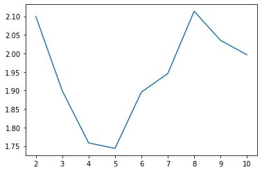
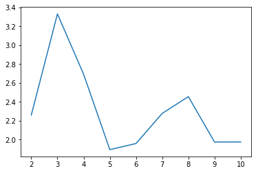
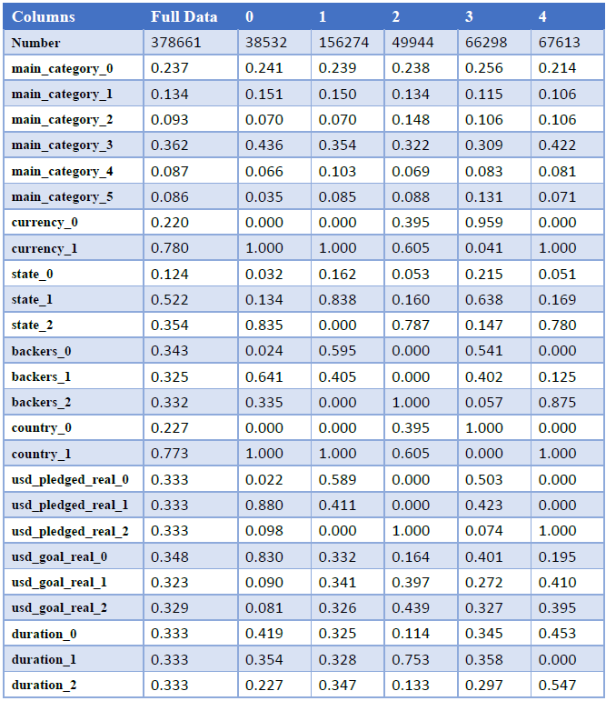
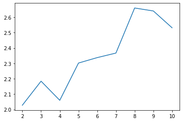
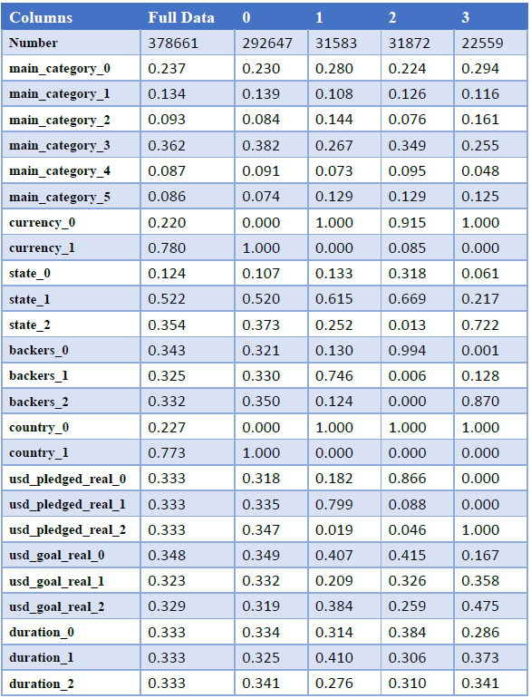

### Kaggle Competition：
https://www.kaggle.com/kemical/kickstarter-projects/data

### Kaggle Cluster - KMeans：

* 結果說明：
*  經過 Davies–Bouldin Index 評估後，可以從圖中看見分為5群較為適合。
*  Cluster-0：在此分群中可以看見，計畫類型較為平均、 貨幣為非美元的較多、 計畫狀態為失敗的比例較高、 國家皆為非美的。
*  Cluster-1：在此分群中可以看見，計畫類型為多媒體比例較高、貨幣主要都是使用美元、計畫狀態多數為成功案例支持者比也較高國家幾乎為美國、 群眾捐款的總額比例較高。
*  Cluster-2：在此分群中可以看見，計畫類型為多媒體比例較高、貨幣主要都是使用美元、計畫狀態多數為失敗案例支持者比也較低國家幾乎為美國、群眾捐款的總額比例較低。
*  Cluster-3：在此分群中可以 看見，計畫類型為多媒體比例較高、貨幣主要都是使用美元、計畫狀態多數為成功案例支持者比較中間國家幾乎為美國、群眾捐款的總額比例較中間計畫目標金則揭示最小金額、整個計畫持續時間較短。
*  Cluster-4：在此分群中可以看見，計畫類型為多媒體比例較高、貨幣主要都是使用美元、計畫狀態多數為失敗案例支持者比較中間國家

### Kaggle Cluster - GaussianMixture：

* 結果說明：
*  經過 Davies–Bouldin Index 評估後，可以從圖中看見分為5群較為適合。
*  Cluster-0：在此分群中可以看見，計畫類型為多媒體比例較高、貨幣 皆為美元、計畫狀態成功的比例較高支持者中國家美國、群眾捐款的總額比例較為中間計畫目標金小。
*  Cluster-1：在此分群中可以看見，計畫類型為多媒體比例較高、貨幣 皆為美元、計畫狀態失敗的比例較高支持者中低國家美國、群眾捐款的總額比例較為中低。
*  Cluster-2：在此分群中可以看見，計畫類型為多媒體比例較高、貨幣為美元比例 略高、計畫狀態成功的較支持者較高 、國家為美國略高、群眾捐款的總額比例較高、計畫目標金額較為中執行期間較為中。
*  Cluster-3：在此分群中可以看見，計畫類型為多媒體比例較高、貨幣為非美元比例較高、計畫狀態失敗的支持者中低、國家皆為非美國、群眾捐款的總額比例較為中低。
*  Cluster-4：在此分群中可以看見，計畫類型為多媒體比例較高、貨幣皆為美元、計畫狀態成功的比例較高支持者高、國家皆是美國、群眾捐款的總額比例較高、計畫目標金額則偏向中高 、計畫執行期間為低與高 。

### Kaggle Cluster - Birch：

* 結果說明：
*  經過 Davies–Bouldin Index評估後，可以從圖中看見分為2群指標為最低，但是在4群的時候也接近最低指標，因此這邊選擇分為4群。
*  Cluster-0：在此分群中可以看見，計畫類型為多媒體比例較高 、貨幣 主要都是使用非美元、 計畫狀態為失敗的比例較高、國家皆為非美家。
*  Cluster-1：在此分群中可以看見，計畫類型較為平均、貨幣主要都是使用美元、 計畫狀態為失敗的比例較高、 支持者為中間國家主要美國、群眾捐款的總額比例較為中間目標金有高也低執行的期間較為中。
*  Cluster-2：在此分群中可以看見，計畫類型為多媒體比例較高、貨幣幾乎都是使用美元、 計畫狀態為失敗的比例較高 、支持者比例較低國家 皆是 美國、群眾捐款的總額比例較低。
*  Cluster-3：在此分群中可以看見，計畫類型較為平均 、貨幣主要都是使用美元 、計畫狀態為成功的比例較高 、支持者比例較高、國家 皆為美國、群眾捐款的總額比例也較高 。
