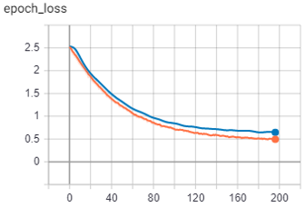

### Kaggle Competition：
https://www.kaggle.com/c/human-protein-atlas-image-classification

### Kaggle Score - DNN Without Selection：

### Kaggle Score - DNN With Selection：

### Kaggle Score - Result：

