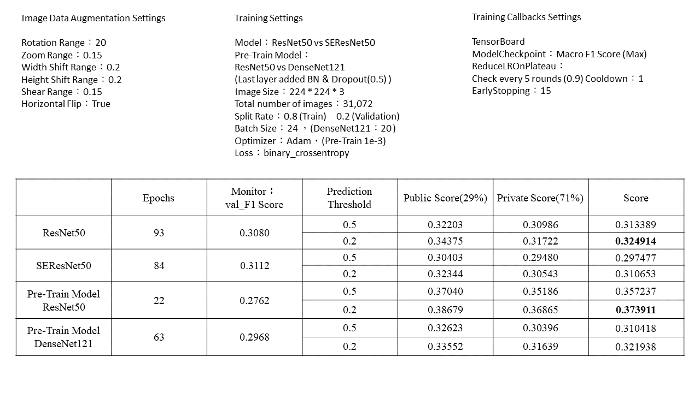
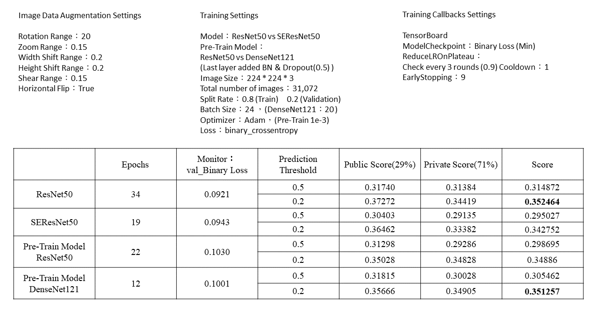

### Kaggle Competition：
https://www.kaggle.com/c/human-protein-atlas-image-classification

### Kaggle Score：
<p align="center">






</p>

### Explanation of each program and folder：
Main training program：
```
train.py
```

Main predicting program：
```
predict.py
```

Merge RGBY image program：
```
convertImg.py
```

Used to save Tensorboard and model folders：
```
Model
```

Folder for training and model framework functions：
```
core
```

Folder for training and saving model functions：
```
core > main.py
```

Folder for model framework functions：
```
core > Model
```